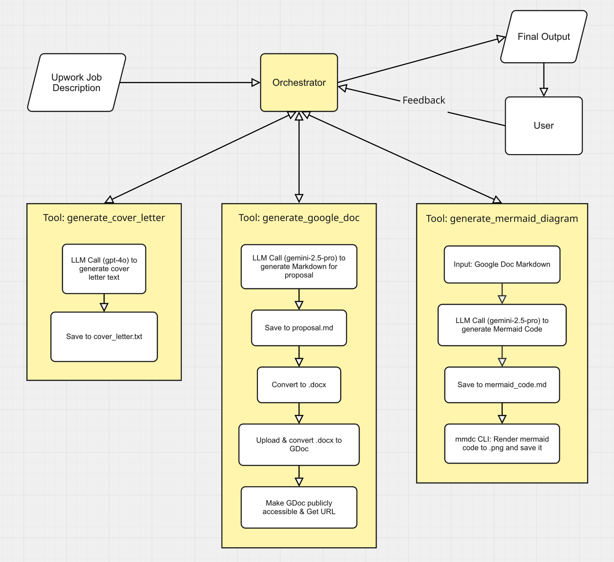

# AI Proposal Agent

This project is a sophisticated, multi-agent system designed to automate the creation of high-quality, customized proposals for freelance jobs on platforms like Upwork. It takes a job description as input and generates a comprehensive proposal package, including a concise cover letter, a detailed Google Doc proposal, and a visual workflow diagram.



## Features

- **Multi-Agent Workflow:** An orchestrator agent manages the overall process, delegating tasks to specialized agents for each part of the proposal.
- **Customizable Cover Letter:** Generates a short, punchy cover letter tailored to the job, ready to be pasted into an Upwork bid.
- **Detailed Google Doc Proposal:** Creates a comprehensive proposal in a Google Doc, complete with project breakdown, relevant experience, and a professional layout.
- **Visual Workflow Diagrams:** Automatically generates a Mermaid diagram to visually explain the proposed plan, making it easy for non-technical stakeholders to understand.
- **Iterative Refinement:** Allows for multi-turn conversations to modify and improve the generated artifacts based on user feedback.
- **Organized File Management:** Saves all generated artifacts for each job into a unique, timestamped directory for easy access and tracking.

## How It Works: The Agentic Workflow

The system is built on LangGraph and operates as a collaborative team of AI agents. While implemented as "tools" in LangGraph, each component acts as a specialized agent with its own LLM and distinct responsibilities.

1.  **The Orchestrator:** This is the project manager. When you provide a job description, the orchestrator analyzes the request and creates a plan. It calls the other agents in a specific sequence.
2.  **`generate_cover_letter` Agent:** The first agent called. It uses GPT-4o to write a concise, attention-grabbing cover letter for the initial Upwork application.
3.  **`generate_google_doc_proposal` Agent:** This agent takes over to build the detailed proposal. It uses Google's Gemini 2.5 Pro model to generate content in Markdown, which is then programmatically converted into a `.docx` file and uploaded to Google Drive as a new, formatted, shareable Google Doc.
4.  **`generate_mermaid_diagram` Agent:** Using the Markdown from the Google Doc proposal, this agent uses Gemini 2.5 Pro to create a Mermaid diagram that visually represents the project plan. It then uses the Mermaid CLI to render this code into a PNG image, which can be pasted into the Google Doc by the user. 
5.  **Final Response:** Once all agents have completed their tasks, the Orchestrator compiles the results: the cover letter text, including the Google Doc link, and the path to the Mermaid diagram image. 

This entire process is stateful, allowing you to ask for changes to any of the generated artifacts in a conversational manner.

## Getting Started

Follow these instructions to set up and run the project on your local machine.

### Prerequisites

- Python 3.8+
- `pip` and `venv`
- Node.js and `npm` (for the Mermaid CLI)
- [Pandoc](https://pandoc.org/installing.html) (for Markdown to DOCX conversion)

### Installation & Setup

1.  **Clone the repository:**
    ```bash
    git clone https://github.com/your-username/your-repo-name.git
    cd your-repo-name
    ```

2.  **Set up a Python virtual environment:**
    ```bash
    python3 -m venv venv
    source venv/bin/activate  # On Windows, use `venv\Scripts\activate`
    ```

3.  **Install Python dependencies:**
    ```bash
    pip install -r requirements.txt
    ```

4.  **Install the Mermaid CLI:**
    ```bash
    npm install -g @mermaid-js/mermaid-cli
    ```

5.  **Set up Google Authentication:**
    - Go to the [Google Cloud Console](https://console.cloud.google.com/).
    - Create a new project.
    - In the project dashboard, search for and enable the **Google Drive API**.
    - Go to "APIs & Services" > "Credentials".
    - Click "Create Credentials" and select "OAuth client ID".
    - Choose "Desktop app" as the application type.
    - After creation, click the "Download JSON" button for the client ID.
    - **Rename the downloaded file to `credentials.json` and place it in the root directory of this project.**
    - The first time you run the application, a browser window will open asking you to authenticate with your Google account. After you approve, a `token.json` file will be created to store your credentials for future runs.

6.  **Set up your LLM API Keys:**
    - Create a file named `.env` in the root directory.
    - Add your OpenAI and Google API keys to this file:
      ```
      OPENAI_API_KEY="..."
      GOOGLE_API_KEY="..."
      ```

### How to Run the Application

1.  **Add the Job Description:**
    - Open/create a `job_description.txt` file in the root directory.
    - Paste the full job description you want to apply for into this file and save it.

2.  **Run the main script:**
    ```bash
    python3 main.py
    ```

3.  **Review the Output:**
    - The agent will process the job description and print the final cover letter and Google Doc URL to the console.
    - All generated files (cover letter text, proposal markdown/docx, diagram code/image) will be saved in a new timestamped folder inside the `generated_content` directory.

4.  **Request Changes (Optional):**
    - After the initial run, the application will enter an interactive loop. You can type requests for changes (e.g., "Make the cover letter more formal" or "Add a step about user testing to the diagram") and the agent will regenerate the relevant artifacts.
    - Type `exit` or `q` to quit.

## Project Structure

```
├── main.py                 # Main application entry point
├── graph.py                # Defines the LangGraph workflow and state
├── prompts.py              # Contains all system prompts for the LLMs
├── schemas.py              # Pydantic schemas for structured LLM output
├── tools/                  # Contains the specialized agents (tools)
│   ├── cover_letter.py
│   ├── google_doc.py
│   └── mermaid.py
├── utils/                  # Utility modules
│   └── file_manager.py     # Handles creation of directories and files
├── job_description.txt     # Input file for the job description
├── generated_content/      # Output directory for all artifacts
└── requirements.txt        # Python package dependencies
```

## Making the Agent Your Own: Personalization

This agent is designed to be adapted to your unique skills and experience. To get the best results, you should customize the prompts and configurations with your own information.

### 1. Update Your Professional Bio

Open `prompts.py` and find the `ABOUT_ME` constant at the top of the file. This is the most important section to update.

Replace the content with your own professional summary, skills, and a bulleted list of your most relevant projects.

```python
# prompts.py

ABOUT_ME = """I'm a [Your Role] who specializes in [Your Specialization].

Relevant projects:
- [Your Project 1]: A brief, impactful description of a project you've completed.
- [Your Project 2]: Another project description, highlighting a different skill or achievement.
- ...
"""
```

### 2. Customize the Google Doc Author Name

The generated Google Doc is given a default name. You should change it to your own.

-   Open `tools/google_doc.py`.
-   Find the `file_metadata` dictionary inside the `generate_google_doc_proposal` function.
-   Update the `"name"` field with your name.

```python
# tools/google_doc.py

# ... inside generate_google_doc_proposal function
file_metadata = {
    "name": f"Proposal - [Your Name Here]",  # <--- CHANGE THIS
    "mimeType": "application/vnd.google-apps.document"
}
```

### 3. Fine-Tune the Example Proposals (Optional)

The agent's ability to generate high-quality proposals and diagrams comes from the detailed examples provided in the prompts. The current examples are for a Generative AI Engineer.

For best performance, especially if you work in a different field, you should replace these with your own examples.

-   **For the Google Doc Proposal:** In `prompts.py`, review the `GOOGLE_DOC_PROPOSAL_SYSTEM_PROMPT`. The template is fairly generic, but you may want to tweak the tone or structure to better match your style.
-   **For the Mermaid Diagram:** In `prompts.py`, review the `MERMAID_DIAGRAM_SYSTEM_PROMPT`. This prompt contains four long, detailed examples of proposals (`Proposal 1` through `Proposal 4`). Replacing these with 2-4 high-quality proposals from your own work history will dramatically improve the quality and relevance of the diagrams the agent generates for you.
